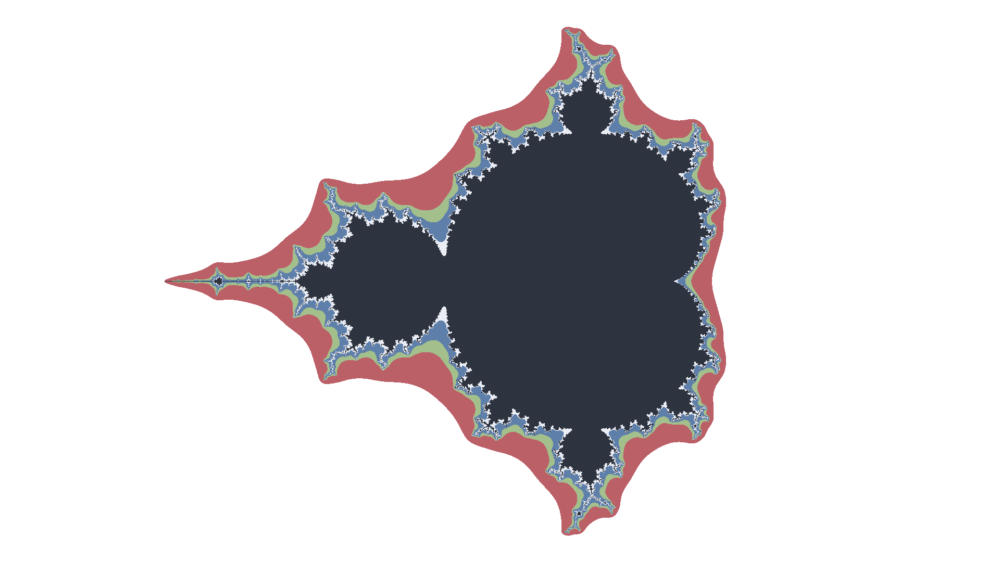
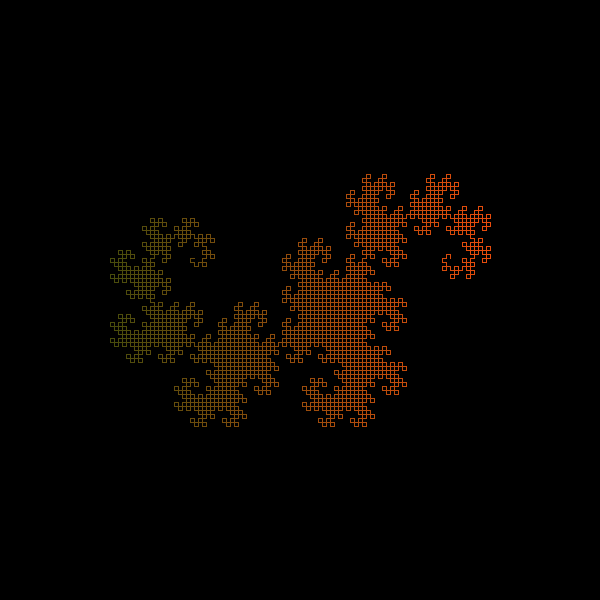

# Playing with [uiua](https://www.uiua.org/)

<table>
  <tr>
    <td width="50%" valign="top">
      <h3>Mandelbrot set fractal</h3>
      
    </td>
    <td width="50%" valign="top">
      <h3>Dragon curve</h3>
      
    </td>
  </tr>
  <tr>
    <td width="50%" valign="top">
      <h3>Levy C curve</h3>
      
    </td>
    <td width="50%" valign="top">
      <h3>sin(x^2) + cos(x^2) = sin(xy)</h3>
      
    </td>
  </tr>
</table>

